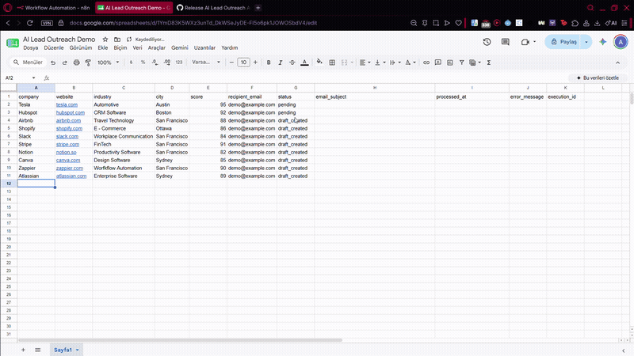
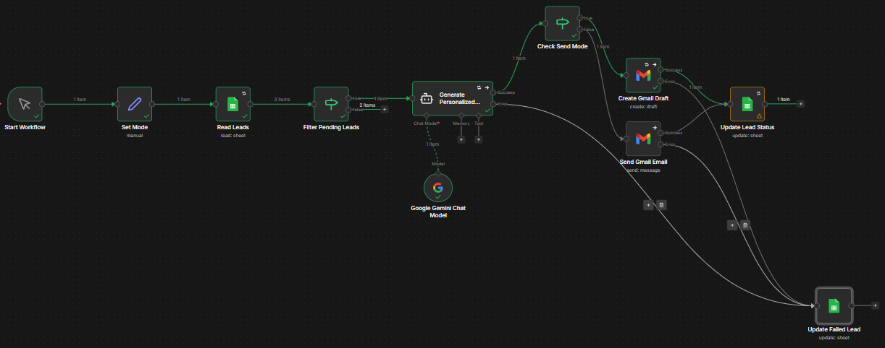
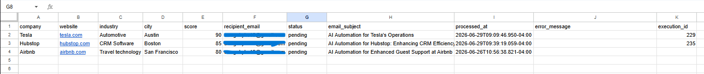
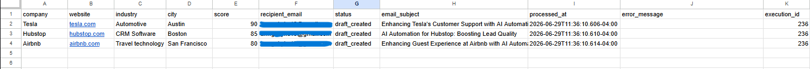
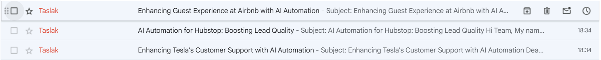
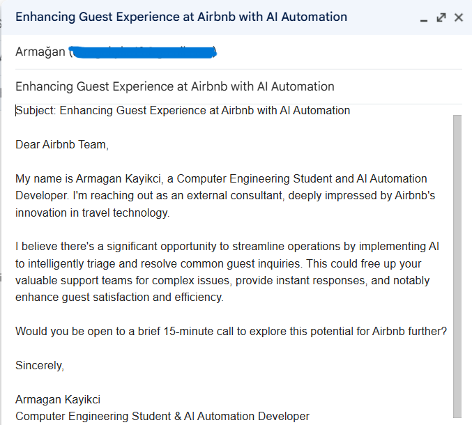

# AI Lead Outreach Automation


An AI-powered lead outreach automation workflow built with **n8n**, **Google Gemini**, **Google Sheets**, and **Gmail**.

This project automates the complete lead outreach pipeline by reading leads from Google Sheets, generating personalized cold emails with AI, creating Gmail drafts or sending emails automatically, and updating execution status back to the spreadsheet.

---

# 🎬 Live Demo

<p align="center">
  
</p>

---

# Features

- 🤖 AI-powered email generation using Google Gemini
- 🎯 Per-lead topic control and manual subject override
- 📊 Google Sheets as a lightweight CRM
- 📧 Draft Mode & Send Mode
- ✅ Automatic lead status updates
- 📝 Execution ID tracking
- ⏱ Process timestamps
- ⚠️ Error logging
- 🔄 Automatic retry mechanism
- 🧩 Modular workflow architecture
- 📈 Easy to extend with new integrations

---

# Workflow Architecture

<p align="center">

</p>

The workflow performs the following steps:

1. Read leads from Google Sheets.
2. Filter leads marked as **pending**.
3. Generate a personalized email using Google Gemini.
4. Parse the AI output into a subject line and an email body.
5. Create a Gmail Draft or send the email directly.
6. Update the lead status and execution metadata.
7. Handle failures automatically.

---

# Technology Stack

| Category | Technology |
|----------|------------|
| Workflow Automation | n8n |
| Artificial Intelligence | Google Gemini |
| Database | Google Sheets |
| Email | Gmail API |
| Version Control | Git |
| Repository | GitHub |

---

# Project Structure

```text
AI-Lead-Outreach-Automation
│
├── images
│   ├── demo.gif
│   ├── workflow.png
│   ├── google_sheet_before.png
│   ├── google_sheet_after.png
│   ├── gmail_draft_total.png
│   └── gmail_draft_content.png
│
├── workflow
│   └── AI Lead Outreach Automation.json
│
├── sample
│   └── sample_leads.csv
│
├── INSTALLATION.md
├── README.md
├── LICENSE
└── .gitignore
```

---

# Screenshots

## Workflow

<p align="center">

</p>

---

## Google Sheet (Before Processing)

<p align="center">

</p>

---

## Google Sheet (After Processing)

<p align="center">

</p>

---

## Gmail Draft

<p align="center">

</p>

---

## Generated Email Content

<p align="center">

</p>

---

# Configuration

Before running the workflow:

- Configure Google Sheets credentials.
- Configure Gmail credentials.
- Configure Google Gemini credentials.
- Update the placeholder Google Sheet ID.
- Configure the sender profile inside the **Configuration** node.

### Campaign Control

Emails are not written at random. What each email talks about is controlled at
two levels, and the row always wins over the campaign default:

| Setting | Where | Effect |
|---------|-------|--------|
| `topic` | Sheet column, per lead | The automation opportunity the email is built around |
| `campaign_topic` | Configuration node | Fallback topic when a row leaves `topic` blank |
| `subject_override` | Sheet column, per lead | Exact subject line to use instead of an AI-written one |
| `campaign_subject_prefix` | Configuration node | Optional prefix added to every subject, e.g. `[Automation]` |
| `email_language` | Configuration node | `Turkish`, `English`, or blank to follow the topic's language |

Leave everything blank and the workflow behaves exactly as before: the AI picks
both the topic and the subject line. Each run writes back `subject_source`
(`manual` / `ai`) and `topic_used` so you can see what the AI decided.

The signature is assembled after generation instead of being written by the AI, so it
is always used exactly as configured. It is built from three Configuration fields:

| Field | Example |
|-------|---------|
| `signature_closing_en` | `Best regards,` |
| `signature_closing_tr` | `Saygılarımla,` |
| `signature_block` | `John Doe`<br>`AI Automation Consultant`<br>`Your Company` |

The closing line follows the language of the email, the block never changes. The
language is decided by `email_language` when set, otherwise by the language the AI
reports on the `Language:` line of its output, falling back to English. Each row's
resolved language is available as `email_language_used`.

---

# Included Resources

- 📄 Public n8n workflow template
- 📊 Sample lead dataset (`sample/sample_leads.csv`)
- 📖 Installation guide (`INSTALLATION.md`)
- 🖼️ Workflow and execution screenshots

---

# Error Handling

Implemented mechanisms:

- Automatic retries
- Failed lead tracking
- Error logging
- Execution ID recording
- Safe workflow continuation
- Automatic status updates

---

# Future Improvements

- HubSpot Integration
- Salesforce Integration
- Airtable Support
- AI Lead Scoring
- Automated Follow-up Emails
- Email A/B Testing
- Analytics Dashboard
- Multi-language Support
- Multiple AI Providers (OpenAI, Claude, Gemini)

---

# Getting Started

1. Clone this repository.
2. Follow the setup instructions in **INSTALLATION.md**.
3. Import the workflow into n8n.
4. Configure your credentials.
5. Update the Google Sheet ID.
6. Configure the sender profile.
7. Execute the workflow.

---

# License

This project is licensed under the **MIT License**.